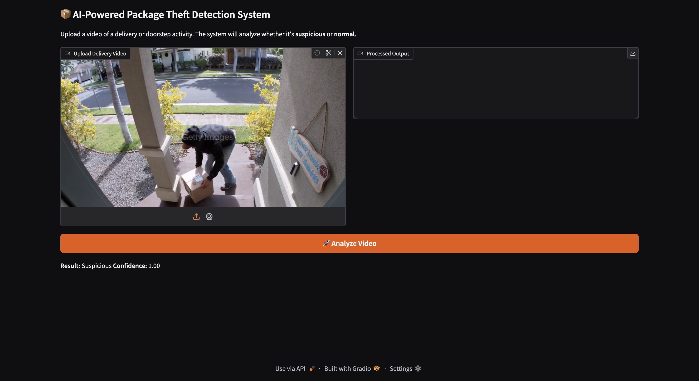

# AI Package Theft Detection System

A computer vision project that detects **suspicious package removal activity** from video footage using **YOLOv8**, **OpenCV**, and a **Gradio web interface**.

This system analyzes delivery footage to determine whether a package might have been stolen based on object detection, tracking behavior, and disappearance patterns.

---

## 📌 Project Overview

Porch piracy is a growing problem. This project uses **AI-powered video analysis** to:

* **Detect People:** Real-time tracking of individuals in the frame.
* **Identify Packages:** Detects boxes, backpacks, handbags, and suitcases.
* **Analyze Behavior:** Monitors interactions between people and packages.
* **Smart Logic:** Identifies when a package disappears after a person approaches.
* **Classification:** Outputs a **Suspicion Score** (Normal vs. Suspicious Activity).

---

## 🎥 How It Works

1.  **Input:** User uploads a video through the Gradio web interface.
2.  **Detection:** YOLOv8 detects people and packages frame-by-frame.
3.  **Tracking:** The system monitors:
    * Spatial distance between person and package.
    * Package visibility/persistence over time.
4.  **Inference:** A behavioral logic model calculates a **suspicion score**.
5.  **Output:** Annotated video with bounding boxes and a final suspicion report.

---

## 🛠 Tech Stack

| Technology | Purpose |
| :--- | :--- |
| **Python** | Core logic & scripting |
| **YOLOv8 (Ultralytics)** | High-speed object detection |
| **OpenCV** | Frame processing & video rendering |
| **Gradio** | Web-based GUI for easy interaction |
| **NumPy** | Vectorized spatial calculations |

---

## 📁 Project Structure

package-theft-detector/
│
├── app.py                 # Main application entry point
├── requirements.txt       # Python dependencies (optional)
├── README.md              # Project documentation
├── models/                # ML / YOLO models
├── outputs/               # Generated annotated videos
└── assets/                # Sample media or resources

## 📸 Screenshots

> A few examples showcasing the application interface and video analysis results.

### 1. Gradio Web Interface
  

### 2. Suspicious Activity Detected
  

### 3. Normal Activity
  

## ⚙️ Installation & Setup

### 1. Clone the repository

git clone https://github.com/navyaravuri/package-theft-detector.git
cd package-theft-detector

### 2. Create a Virtual Environment

# For macOS/Linux
python3.11 -m venv venv
source venv/bin/activate

# For Windows
python -m venv venv
venv\Scripts\activate

### Install Dependencies

pip install --upgrade pip
pip install ultralytics opencv-python gradio numpy

### Run the Application Locally

python app.py
Note: Once running, the terminal will provide a local URL: 'http://127.0.0.1:7860'. Open this in your browser to use the app.

## 🚀 How to Use

1. **Upload**  
   Drop a delivery or security camera video into the interface.

2. **Analyze**  
   Click the **Analyze Video** button to begin processing.

3. **Wait**  
   The system will analyze the video frame-by-frame. Processing time depends on video length.

4. **Results**  
   Download and view:
   - The annotated output video  
   - The **Suspicion Classification**  
   - The **Confidence Score**
